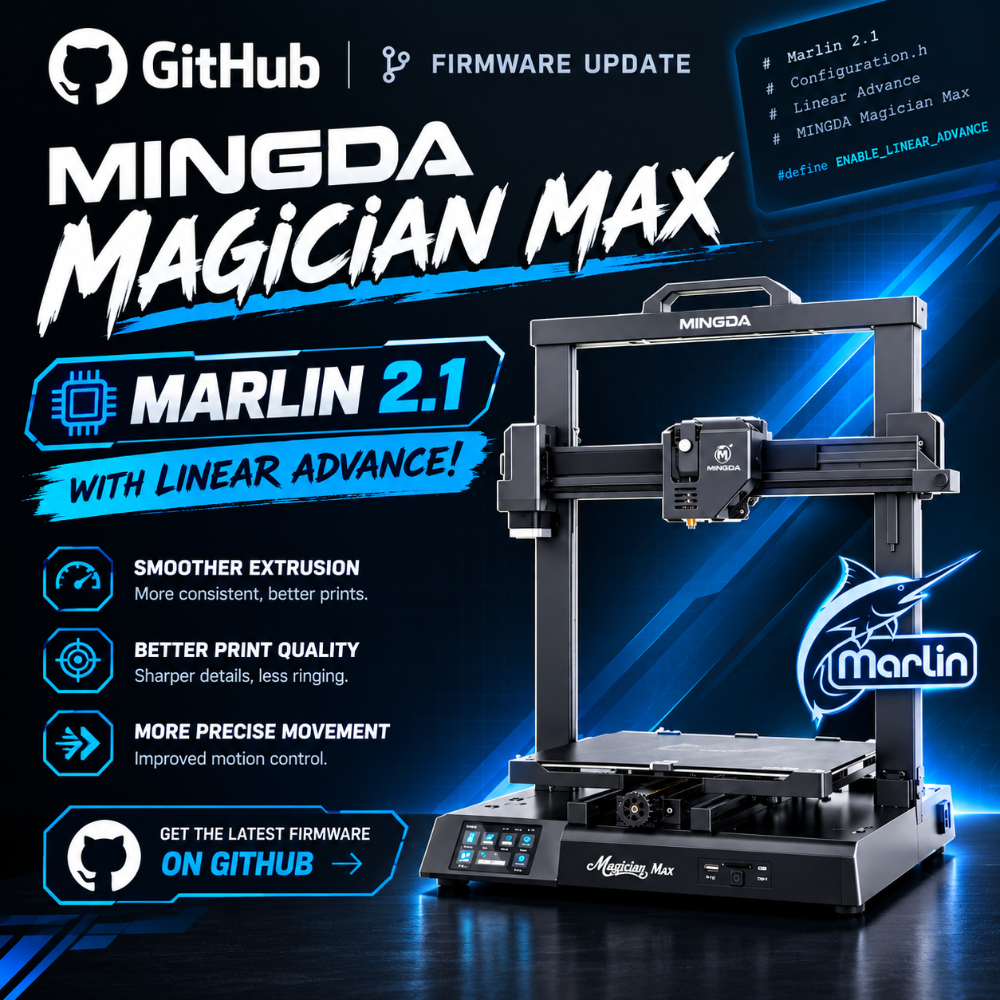

# Mingda Magician Max (GD32) — Marlin 2.1 Firmware

Custom Marlin **2.1.2.8** firmware for the **Mingda Magician Max (GD32 chip
version)**, ported from the original working **Marlin 2.0.x** port
(`update/Marlin-2.0.x`, vendor version `1.6.7.7`).

> The original stock Marlin README is preserved in [`MarlinReadme.md`](MarlinReadme.md).

---

## Printer specifications

| Item | Value |
|---|---|
| Printer | Mingda Magician Max (GD32 chip version) |
| Mainboard | `langgo407` / `BC.DZ.PC000007` |
| MCU | GD32F407VET6 (STM32F407-compatible), Cortex-M4 @ 168 MHz |
| Memory | 512 KB Flash, 192 KB RAM |
| Bootloader | `0x08000000`, application at **`0x08010000`** (offset `0x10000`) |
| Firmware update | Put `firmware.bin` in the SD-card root and power on the printer |
| Build volume | 320 × 320 × 400 mm |
| Stepper drivers | TMC2208 (UART, half-duplex), 16 microsteps, interpolated to 256 |
| Axis steps/mm | X 80, Y 80, Z 800, E 416.6 (calibrated over 100 mm) |
| Max feedrate | 150 / 150 / 20 / 45 mm/s |
| Max acceleration | 600 / 600 / 100 / 700 mm/s² |
| Jerk | X 10, Y 8, Z 10, E 7 mm/s |
| Hotend | 100K thermistor (`TEMP_SENSOR_0 = 1`), titanium heatbreak (300 °C max) |
| Bed | 100K thermistor (`TEMP_SENSOR_BED = 1`), PID (`PIDTEMPBED`) |
| Leveling | D301 auto-leveling, Hall-plate fixed probe, Bilinear 4×4 grid |
| Display | Proprietary 480×320 FSMC TFT (ST7796/ILI9488-class) + XPT2046 touch |
| Storage | SD card (software SPI), USB flash drive (USB host), W25Q64 SPI flash (8 MB) |
| Sensors | Filament runout |
| Features | USB-disk printing, power-loss recovery, custom touch UI |

---

## Firmware

- **Version:** Marlin 2.1.2.8 (`SHORT_BUILD_VERSION`).
- **Machine name:** `MAGICIAN MAX`.
- **Build environments:**
  - `langgo407ve_gd` — GD32 chip (default)
  - `langgo407ve_st` — ST chip (`-DST32_SHIP`)
- **Build:**
  ```bash
  pio run -e langgo407ve_gd
  ```
- **Output:** `.pio/build/langgo407ve_gd/firmware.bin` — a fresh copy is also
  placed in `_FIRMWARE/firmware.bin` and `Desktop/fw/firmware.bin`.

Resource usage: **Flash ≈ 92 %**, **RAM ≈ 26 %**.

---

## Updating the firmware (SD card)

1. Build the firmware:
   ```bash
   pio run -e langgo407ve_gd
   ```
2. Copy the freshly built `firmware.bin`
   (from `.pio/build/langgo407ve_gd/`, or the copy in `_FIRMWARE/`).
3. Copy `firmware.bin` to the **root of the SD card** (FAT32, ≤ 32 GB).
4. Insert the SD card into the printer and **power it on**.
   The bootloader at `0x08000000` flashes the application to `0x08010000`.
5. Wait for the Marlin boot screen, then remove the SD card.

## Updating the display icons

The 480×320 TFT UI loads its icons from the on-board **W25Q64 SPI flash**. To
update them:

1. Copy the `_ICONS/TFT35` folder to the **root of the SD card**, so the card
   contains `TFT35/bmp/*.bmp` (67 icons).
2. Insert the SD card and **power on**. At boot the firmware flashes the icons
   from `TFT35/bmp` into the W25Q64.
3. After the boot screen appears, **remove the `TFT35` folder from the SD card**.
   (The firmware re-flashes the icons on every boot while the folder is present.)

> An optional `TFT35/font` folder (`byte_a~1.fon`, `word_u~1.fon`) updates the
> UI fonts the same way.

## First-time setup (after flashing)

1. Power on the printer and let it boot.
2. Open **Info** in the menu and press **`RELOAD FACTORY DEFAULTS`**
   (this runs `M502` then `M500`, resetting the EEPROM to the firmware defaults).
3. **Recycle the power** — turn the printer off and back on.
4. Run the **bed leveling** procedure (auto-level: `G28` + `G29`, 4×4 grid).
5. Do the **Babystep / Z-offset** procedure to set the first-layer height.

## Linear Advance

Linear Advance is **enabled by default** with `ADVANCE_K = 0.072`
(tuned for this direct-drive, titanium-heatbreak setup). The running value is
stored in EEPROM; the compiled default (`0.072`) is what `M502` restores.

- **Read** the current value: send `M900` (reports `K`).
- **Change** it: `M900 K<value>` (e.g. `M900 K0.05`), then `M500` to save.
- **Disable** it: `M900 K0`.
- It can also be changed live during a print from the G-code console.

The default is defined in `Marlin/Configuration_adv.h`:
```c
#define ADVANCE_K 0.072
```

---

## What was updated / ported (2.0.x → 2.1)

### Board & HAL
- Added `BOARD_LANGGO407` and `Marlin/src/pins/stm32f4/pins_langgo407.h`.
- Added `buildroot/share/PlatformIO/boards/marlin_langgo407ve.json`
  (variant `MARLIN_F407VE`, `stm32f407vet6`).
- Added `langgo407ve_gd` / `langgo407ve_st` environments in `ini/stm32f4.ini`
  with `board_build.offset = 0x10000` and the custom libs.
- Enabled `HAL_SRAM_MODULE_ENABLED` (FSMC LCD) and `HAL_HCD_MODULE_ENABLED`
  (USB host) in the `MARLIN_F407VE` variant, and defined `UNUSED()` early to
  avoid core/HAL include-order errors.
- Fixed `UNUSED` include ordering in `Marlin/src/udisk/stm32_usb.cpp`.

### Configuration
- Migrated the proven 2.0 printer configuration to 2.1, applying the Marlin
  `Changes.h` renames, e.g.:
  `Z_PROBE_FEEDRATE_FAST/SLOW`, `HOMING_FEEDRATE_MM_M`,
  `DEFAULT_STEPPER_TIMEOUT_SEC`, `BED_TRAMMING_*`, `DEFAULT_KP/KI/KD`,
  `DEFAULT_BED_KP/KI/KD`, `ADVANCE_K`, `MIN_CIRCLE_SEGMENTS`,
  `MIN_ARC_SEGMENT_MM`/`MAX_ARC_SEGMENT_MM`, `DISABLE_IDLE_*`, `SDSORT_FOLDERS`,
  `SPINDLE_LASER_USE_PWM`, etc.
- Config version bumped to `02010206`.
- `HEATER_0_MAXTEMP` lowered **315 → 300** to satisfy the 2.1 thermistor
  safety assertion (thermistor table max 315 with `HOTEND_OVERSHOOT = 15`).
- Removed the generic `TFT_GENERIC` block; the proprietary `MD_FSMC_LCD` UI is
  used instead.
- Stock configs kept for reference:
  `Marlin/Configuration.h.stock-2.1` and `Marlin/Configuration_adv.h.stock-2.1`.

### Proprietary display (touch UI)
- Ported `Marlin/src/lcd/extui/lib/tsc` (480×320 FSMC TFT + XPT2046 + W25Qxx
  UI, ~18k lines) and `Marlin/src/lcd/extui/extui_btt_menu.cpp`.
- `MD_FSMC_LCD` now enables `EXTENSIBLE_UI` (`Conditionals_LCD.h`); `LCD_Setup()`
  is called from `setup()`.
- Adapted the UI to the 2.1 API (`FileList::firstOpenPrint`, `getFlow_percent`,
  `bedlevel.z_values`, `queue.ring_buffer.length`, `mm_per_step`, media/root
  APIs, `ExtUI` callback signatures, etc.).
- Also carried over the optional DWIN/serial-LCD path (`lcd/mingda_lcd`,
  `lcd_show_addr.*`), disabled by default (`USART_LCD`).

### USB-disk printing
- Ported `Marlin/src/udisk` (FATFS + STM32 USB Host MSC) and hooked it into
  `MarlinCore.cpp` (`MX_USB_HOST_Init`/`MX_USB_HOST_Process`, `udisk.InitUdiskPin`).
- Added `HAS_UDISK`/`MD_FSMC_LCD` source filters in `ini/features.ini`.

### EEPROM on W25 SPI flash
- Re-enabled `W25QXX_SPI_EEPROM` as a wired EEPROM backend
  (`HAL/shared/eeprom_if_w25qxx.cpp`, `eeprom_if.h`, `eeprom_wired.cpp`,
  `Conditionals_post.h`).

### Libraries
- Copied from 2.0.x into `Marlin/lib/`: `rtt`, `fat_fs`,
  `STM32_USB_Host_Library`, `GD32F4xx_standard_peripheral`,
  `GD32F4xx_usb_library`, `LodePNG`.

---

## Known limitations

These compile and link but were not fully re-validated on hardware:

- **USB-disk power-loss recovery** is stubbed (`recovery.prepare_u()` /
  `check_u()` are no-ops). SD-card power-loss recovery works normally.
- `wait_quick_stop_step` is defined but the 2.0 `stepper.cpp` quick-stop gate
  was not ported, so the quick-stop popup no longer halts the step buffer.
- `HEATER_0_MAXTEMP` is 300 °C (was 315). To restore 315, set
  `HOTEND_OVERSHOOT 0` or use a thermistor table with a higher maximum.
- `langgo407ve_st` builds, but was not flashed/tested.
- `USART_LCD` / DWIN serial-display path is present but disabled.
